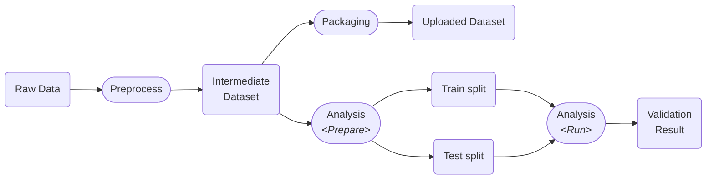
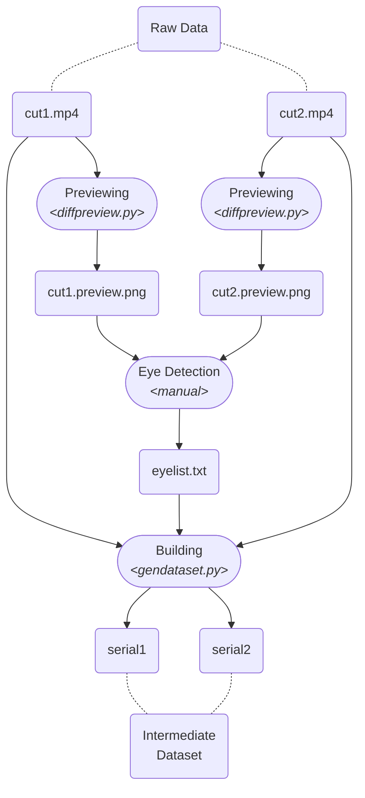
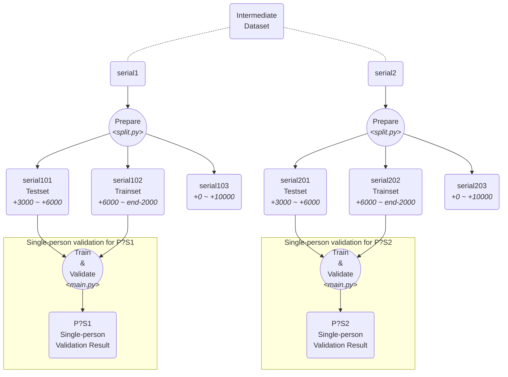

# ARGaze Workflow

## Stages

We provided source code and scripts for the following three stages and few sub-stages: (related code are placed inside the folder with exactly the same name in lower case)

1. Preprocessing
2. Analysis
3. Packaging
   1. Prepare
   2. Run

The complete process of the dataset is presented below. Note that the description below only focus on one specific participant's data, we will use `P?` to refer to the participant in the following text. Without any extra description, the data in the following text will also refer to one specific participant's data.



## Preprocessing

In this stage, we generate the dataset from video inputs and annotations. The input data here is already processed to remove participant-indicated unavailable fragments, consisting of two separate videos (namely `cut1.mp4` and `cut2.mp4`, which representing video from AR scene and real-world scene, respectively.) The output of this stage also consists of two part, namely `serial1` and `serial`, representing dataset from AR scene and real-world scene, respectively.

There are three close-related processes in preprocessing: preview image generation (`diffpreview.py`), eye detection (manual operation) and dataset building (`gendataset.py`)



It is worthy mentioning that we have to write a `eyelist.txt` manually to describe the position of eye under the eye camera.

### eyelist.txt

We check the position of eye in an image MANUALLY to ensure detection quality. The `eyelist.txt` describes the bounding rectangle of participants' eyes in videos. To assist the process, we may run diffpreview.py on each video to generate the "average frame", which have a blurry eye image in it (since the relative position of participants' head and the headset is fixed). We marked a rectangle containing the full eye, and saved it in `eyelist.txt`. When `eyelist.txt` is created, we can run `gendataset.py`, which complete the rest process to generate the dataset.

A example of `eyelist.txt` is provided below:

```
1: 738x196+216+378, 1828x180+191+404
2: 569x270+207+347, 2012x68+189+379
```

### `gendataset.py`

This script read data from two input videos and the `eyelist.txt` and perform several operations on it:

- Extract left and right eye image sequences from video `cut1.mp4` according `eyelist.txt` (use the center of the described rectangle as the center of our 512x512 clipping window)
- Blink detection on left eye to remove relevant frames
- Blink detection on right eye to remove relevant frames
- AR (or real-world) marker detection on AR (or real-world) scene, and remove frames that fails to detect a marker on
- Save two eye image sequences (from left and right eye) as two one-image-one-frame sequences in the `serial1` folder
- Save the scene camera's view as video file in the `serial1` folder
- Save the detected markers' position in the `serial1` folder
- Performa all operations above for `cut2.mp4` to generate `serial2`

## Analysis

The main purpose for analysis is to validate the dataset's quality by training and validating a predicting model.

The generated dataset contains two 

1. Train-test split. (`prepare/split.py`)
2. Perform training and validate the result on selected training and testing set. (`run/main.py`)

In the following flowgraph, we only present the simplest task: predicting user-dependent eye-tracking data using only one participant's data in one scene. The actual testing strategic is complicated and is not provided, you may refer to our paper for more information.

You can run `main.py --help` for its usage.




## Packaging

Generate the packaged dataset (what we uploaded on OSF) from intermediate format.

We use LSF to manage the tasks. Therefore, some logics are inside `genset.lsf`. It is basically a BASH script with special annotation at the beginning for LSF. You have to make a directory called `memdisk` under `/tmp` before run the script, and make sure the data for all 25 participants are placed inside `dataset2_test${PARTICIPANT_ID}` directory. Before using our packaging script, you should install the dependencies in the following list. The `genset.lsf` will invoke `genset.py` and the generation should completed automatically without human inference.


Dependencies:

- ffmpeg binary (for video processing)
- pigz binary (for parallel TAR.GZ compression)


The parameter for `genset.lsf` is passed in environment variables, here is simple bash script to submit all dataset generation job to LSF.

```bash
#!/bin/sh
for PERSON in `seq 1 1 25`; do
	export PERSON IN_SERIAL=1 OUT_SERIAL=
	bsub < genset.lsf;
	export PERSON IN_SERIAL=2 OUT_SERIAL=
	bsub < genset.lsf
done
```

Here is a sample view of work directory where you launch `genset.lsf`:

```
|-dataset2_test1
| |-serial1
| | |-0
| | | `-all.mp4
| | |-1
| | | `- (tens of thousands of images)
| | `-2
| |   `- (tens of thousands of images)
| `-serial2
|   `-(the same structure as serial 1)
|-dataset2_test2
| `-(the same structure as dataset2_test1)
`-(more participants)
```

